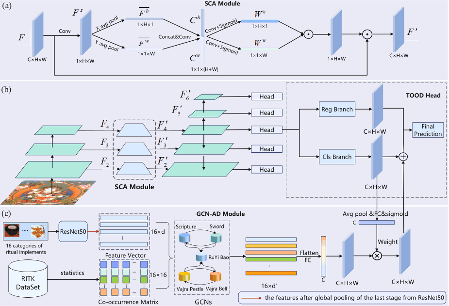
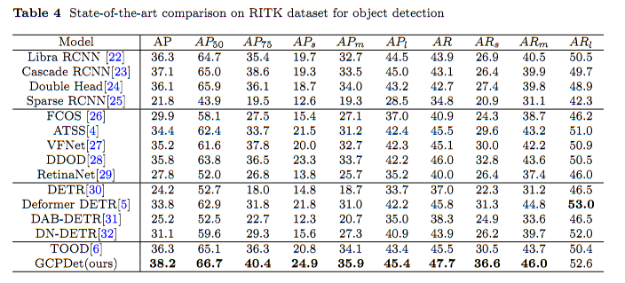

# Guided Compositional Priors for Improved Ritual Implements Detection in Thangka Paintings

It's official code implementation.

# Abstract

This study focuses on detecting ritual implements in Thangka paintings, an essential art form in Tibetan Buddhism. Due to their complex composition and small sizes, existing object detection models struggle in this domain. We propose Guided by Principles of Composition Detector (GPCDet), which incorporates Spatial Coordinate Attention (SCA) and Graph Convolution Network-Auxiliary Detection (GCN-AD) modules. The SCA module captures distinctive spatial features, while the GCN-AD learns co-occurrence relationships among categories. Extensive experiments on the Ritual Implements in Thangka (RITK) dataset demonstrate that GPCDet significantly outperforms previous methods, achieving an average precision of 38.2\%, highlighting its effectiveness in accurately detecting ritual implements in Thangka art.

# Method

<!--Given an image  we extract feature maps  using backbone, where  denotes the -th level of the feature map.-->
<!--The subsequent Spatial Coordinate Attention (SCA) module processes each level of the feature map to generate fused features with spatial information across multiple scales, denoted as . Additionally,  and  are produced by applying convolutional layers with a stride of 2 on  and , respectively, to detect objects of different sizes at different levels of feature maps.-->
<!--Each level of  is then processed through its respective detection head (T-Head). The T-Head consists of a classification branch for category prediction and a regression branch for bounding box determination. Notably, we fuse the feature  with co-occurrence feature vectors generated by the GCN-AD module. This fusion incorporates RITK co-occurrence relationships with classification features, thereby enhancing detection accuracy.-->

# Results

# Install

Please refer to [mmdetection](https://github.com/open-mmlab/mmdetection).

